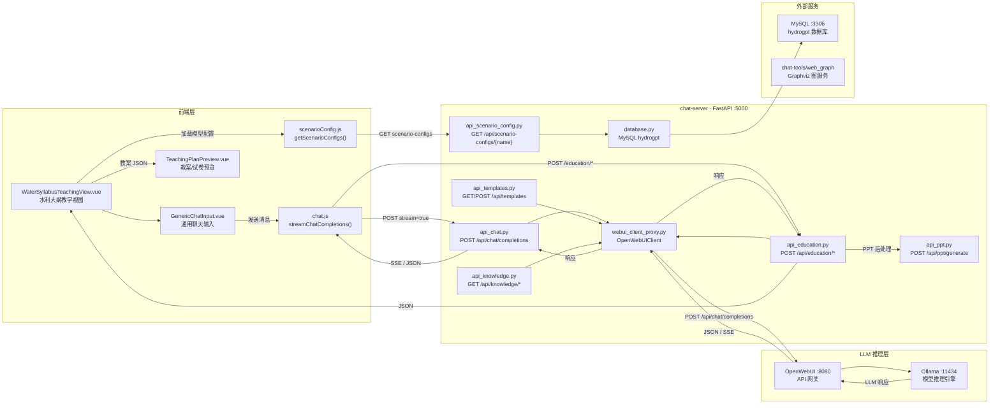
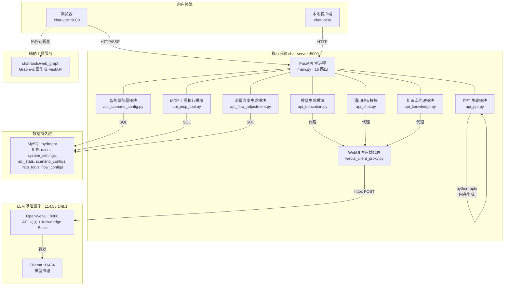
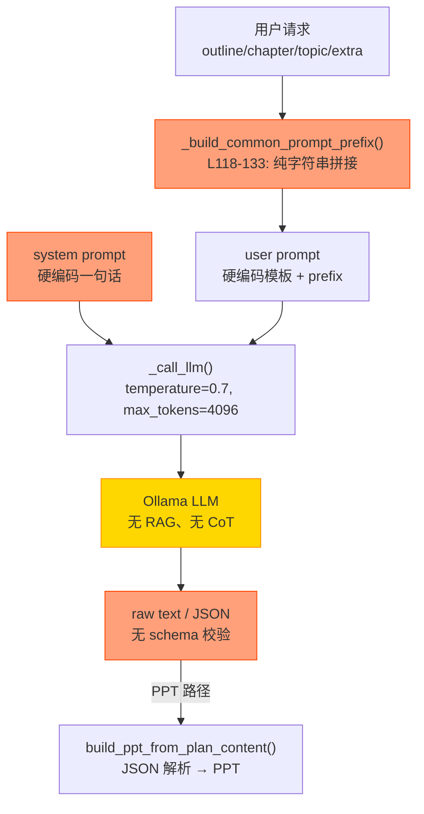
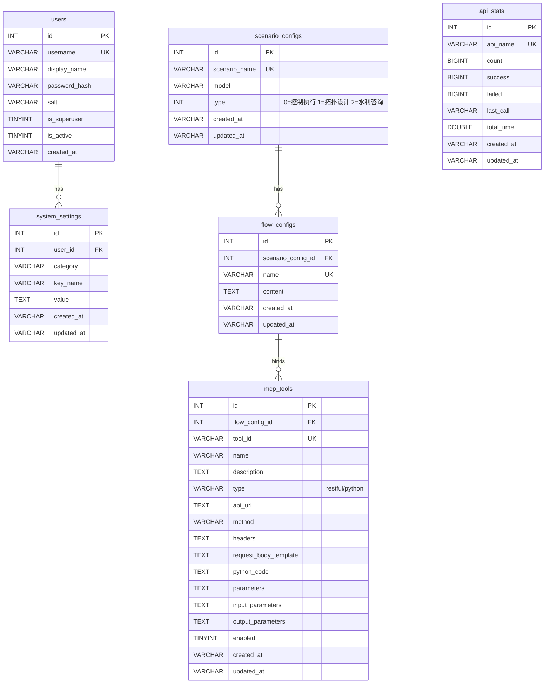

# 水利生成智能体 — 当前架构与瓶颈分析报告

> 生成日期：2026-03-15 | 分析范围：`chat-server`、`chat-vue`、`chat-tools`、`chat-local`

---

## 一、整体数据流图

### 1.1 端到端请求数据流



### 1.2 微服务 / Agent 交互拓扑图



---

## 二、逻辑断点排查 — Prompt 链条幻觉风险分析

### 2.1 教育生成模块 Prompt 链路全景



### 2.2 逻辑断点详表

| # | 文件 | 行号 | 函数/逻辑节点 | 风险等级 | 风险描述 | 根因 |
|---|------|------|---------------|----------|----------|------|
| 1 | `api_education.py` | L118-133 | `_build_common_prompt_prefix()` | 🔴 高 | 仅将 `outline/chapter/topic` 等拼为纯文本前缀，**无领域知识注入**。当用户输入"CAMELS-China 数据集的降雨径流模型"时，LLM 缺乏参考语料，极易产生"幻觉"式推导 | 缺少 RAG 增强：未调用 `api_knowledge.py` 检索水利规范 |
| 2 | `api_education.py` | L156-158 | `generate_teaching_plan` system prompt | 🔴 高 | `"你是水利大纲教学生成智能体，专门根据课程大纲生成规范、可用的教案。"` — 单句 system prompt，无角色深化、无能力边界约束、无输出格式规范 | 缺少结构化 CoT 骨架 |
| 3 | `api_education.py` | L230-237 | `generate_ppt_teaching_plan` JSON 生成 | 🔴 高 | 要求 LLM 输出纯 JSON，但 L247-253 的 markdown 剥离逻辑脆弱（仅处理 \`\`\`json 包裹的情况）；若 LLM 输出混合文本+JSON，解析失败 | 无 JSON schema 校验、无重试机制 |
| 4 | `api_education.py` | L97-115 | `_call_llm()` 参数 | 🟡 中 | 所有 4 种生成任务使用**相同**的 `temperature=0.7, max_tokens=4096`。试卷生成需低温(0.2-0.3)保证答案准确，教案需高 token 上限 | 无按任务类型动态调参 |
| 5 | `api_education.py` | L299-304 | `generate_exam_paper` prompt | 🟡 中 | 试卷生成的 system prompt 无水利专业题库约束，LLM 可能生成偏离大纲的题目或答案错误的计算题 | 无考纲范围约束、无参考答案校验 |
| 6 | `webui_client_proxy.py` | L74-76 | `enable_thinking: False` | 🟡 中 | 非流式模式强制禁用 thinking，但水利推导类任务（如水库调度逻辑）需要逐步思考才能保证正确性 | 一刀切禁用思考模式 |
| 7 | `api_education.py` | 全文 | 无知识库集成 | 🔴 高 | 教育模块 4 个端点均**未调用** `api_knowledge.py` 的任何方法。`chat-server` 已有知识库 CRUD 能力，但教育生成完全未使用 | 设计时未考虑 RAG 增强 |
| 8 | `WaterSyllabusTeachingView.vue` | L210-236 | `buildExamRequestMessage()` | 🟡 中 | 试卷请求在前端拼装 prompt，题型和数量由用户输入，但无对输入的合理性校验（如要求 100 道计算题） | 前端未限制非合理参数范围 |

### 2.3 因果倒置高发场景

以下为 LLM 在当前 Prompt 链条下容易输出因果错误的水利知识场景：

| 场景 | 期望推导链 | 当前风险 |
|------|-----------|----------|
| **降雨径流模型** | 降雨 → 产流(蓄满/超渗) → 汇流(单位线) → 洪峰 | LLM 可能直接给出洪峰值而跳过产汇流过程，或混淆蓄满产流与超渗产流 |
| **水库调度** | 预报来水 → 校核防洪限制水位 → 计算下泄能力 → 制定泄洪方案 | LLM 可能在未考虑下游承受能力的情况下直接计算泄洪量 |
| **明渠恒定流计算** | 已知条件 → 曼宁公式 → 迭代求解水深 → 校核弗劳德数 | LLM 可能直接给出水深而未说明迭代过程，或弗劳德数判据出错 |
| **防洪标准** | GB 50201 → 确定工程等级 → 查表得设计洪水标准 → 推求设计洪水 | LLM 可能引用过时标准或混淆校核与设计标准 |

---

## 三、全链路耗时追踪

### 3.1 请求链路耗时分解

```mermaid
gantt
    title 教案生成请求全链路耗时（典型值）
    dateFormat X
    axisFormat %s秒

    section 前端
    Vue 组件事件处理     :a1, 0, 50
    Fetch API 发起请求   :a2, 50, 100

    section 网络
    前端 → FastAPI       :b1, 100, 120

    section FastAPI
    路由分发 + 参数校验   :c1, 120, 130
    DB 查询模型绑定       :c2, 130, 150
    构建 Prompt 字符串    :c3, 150, 155

    section LLM 推理
    FastAPI → OpenWebUI   :d1, 155, 170
    OpenWebUI → Ollama    :d2, 170, 185
    Ollama 推理（主瓶颈） :crit, d3, 185, 60185
    Ollama → OpenWebUI    :d4, 60185, 60200
    OpenWebUI → FastAPI   :d5, 60200, 60220

    section 后处理
    JSON 解析             :e1, 60220, 60230
    PPT 生成(可选)        :e2, 60230, 60430

    section 返回
    FastAPI → 前端        :f1, 60430, 60450
    前端渲染              :f2, 60450, 60550
```



### 3.2 耗时瓶颈定量分析

| # | 链路段 | 组件 | 耗时范围 | 占比 | 瓶颈原因 | 代码位置 |
|---|--------|------|----------|------|----------|----------|
| 1 | **LLM 推理** | Ollama | **20–120s** | **~97%** | 教案/试卷生成需 2000-4000 token 输出，非流式模式下须等待全部生成完毕 | `webui_client_proxy.py` L134-153: `timeout=300s` |
| 2 | 模型配置查询 | MySQL | 10-30ms | <0.1% | 每次请求都新建 DB 连接（无连接池），查询 `scenario_configs` | `api_education.py` L57-82: `_get_education_model()` |
| 3 | OpenWebUI 客户端初始化 | httpx | 5-15ms | <0.1% | 每次 LLM 调用都创建新的 `OpenWebUIClient` + `httpx.AsyncClient` 实例 | `api_education.py` L85-94: `_get_openwebui_client()` |
| 4 | PPT 生成 | python-pptx | 100-500ms | <1% | 内存中生成 `.pptx`，幻灯片数量多时耗时增加 | `api_ppt.py` L309-350: `_build_pptx()` |
| 5 | 前端 HTML 渲染 | Vue 3 | 50-200ms | <0.5% | `v-html` 直接渲染，非虚拟 DOM 更新路径 | `WaterSyllabusTeachingView.vue` L162-176 |
| 6 | **无缓存命中** | — | **+20-120s** | **2x** | 完全相同的请求（同一课题/章节）每次都要重新调用 LLM | 全局无缓存层 |
| 7 | **无知识库检索** | — | — | — | 教育模块未集成 RAG，导致 Prompt 缺少上下文，LLM 需更多 token 才能生成合理内容 | `api_education.py` 未 import `api_knowledge` |

### 3.3 资源瓶颈矩阵

| 资源 | 当前配置 | 问题 | 影响 |
|------|---------|------|------|
| **LLM 推理** | 单一 Ollama 实例 | 无负载均衡，多用户并发时串行排队 | 响应延迟线性增长 |
| **HTTP 客户端** | 每次请求新建 `httpx.AsyncClient` | 无连接复用，TCP 握手开销 | `webui_client_proxy.py` 所有方法均 `async with httpx.AsyncClient()` |
| **DB 连接** | 每次请求新建 `pymysql.connect()` | 无连接池 | `database.py` L37-55: `_get_mysql_connection()` |
| **缓存** | `config.yaml` L64-69: `cache.enabled: false` | 缓存系统配置存在但被禁用，且实现仅为占位 | 无任何缓存命中可能 |
| **PPT 缓存** | `api_ppt.py` L24: `_ppt_cache: Dict` 内存字典 | 进程重启即丢失，无持久化 | 重复生成浪费 CPU |

---

## 四、现有数据库 Schema 分析

### 4.1 MySQL `hydrogpt` 表结构



### 4.2 教育智能体相关缺失

| 缺失能力 | 说明 |
|----------|------|
| 大纲版本管理 | 无表存储不同版本的教学大纲、章节结构 |
| 模板注册与版本控制 | Prompt 模板硬编码在 Python 代码中，无法动态管理 |
| 生成结果缓存 | 无表存储已生成的教案/试卷，无法复用 |
| 用户生成历史 | 无表记录"谁在什么时间为哪个课题生成了什么内容" |
| 水文图表元数据 | 无表存储 CAMELS-China 等水文数据集的元信息 |

---

## 五、前端架构分析

### 5.1 教育模块组件树

```
WaterSyllabusTeachingView.vue (452行)
├── Sidebar.vue                     ← 通用侧边栏
├── GenericChatInput.vue            ← 通用聊天输入（scenario-name="水利大纲教学生成智能体"）
├── ChatHistory.vue                 ← 对话历史（hide-json-in-assistant=true）
├── TeachingPlanPreview.vue (36KB)  ← 教案/教学日志/试卷 JSON 预览 + 试卷生成
│   └── ExamPreview.vue (16KB)      ← 试卷预览子组件
└── LoadingOverlay.vue              ← 加载动画
```

### 5.2 前端瓶颈

| # | 问题 | 位置 | 影响 |
|---|------|------|------|
| 1 | 非流式等待 | `chat.js` L23-34: `chatCompletions()` 使用 axios 同步等待 | 教育模块的 `_call_llm(stream=False)` 前端需等待全部生成完毕才显示 |
| 2 | `v-html` 渲染 | `WaterSyllabusTeachingView.vue` L68 | 大量 HTML 直接注入，无 markdown 解析、无代码高亮 |
| 3 | JSON 预览开销 | `TeachingPlanPreview.vue` 36KB | 教案 JSON 解析和预览逻辑复杂，大教案可能导致 UI 卡顿 |
| 4 | 无增量更新 | `contentHtml` computed 每次重算所有消息 HTML | 消息越多，计算量线性增长 |

---

## 六、关键结论

### 核心痛点优先级排序

| 优先级 | 痛点 | 用户感知影响 | 技术修复难度 |
|--------|------|-------------|-------------|
| **P0** | LLM 推理 20-120s 非流式阻塞 | 用户感受到"死等" | 中（改为流式） |
| **P0** | 无 RAG — 教育模块未接入知识库 | 生成内容不专业、有幻觉 | 高（需设计 RAG 管线） |
| **P1** | 硬编码 Prompt — 无法迭代优化 | 生成质量无法持续改进 | 中（模板引擎重构） |
| **P1** | 无缓存层 — 重复请求重复推理 | 资源浪费、响应慢 | 中（缓存层设计） |
| **P2** | 无逻辑校验 — 输出可能有因果错误 | 教学内容可信度低 | 高（校验 Agent） |
| **P2** | DB 连接无池化 | 高并发下连接耗尽 | 低（引入连接池） |
| **P3** | 前端非流式渲染 | 等待体验差 | 中（SSE 接入） |
