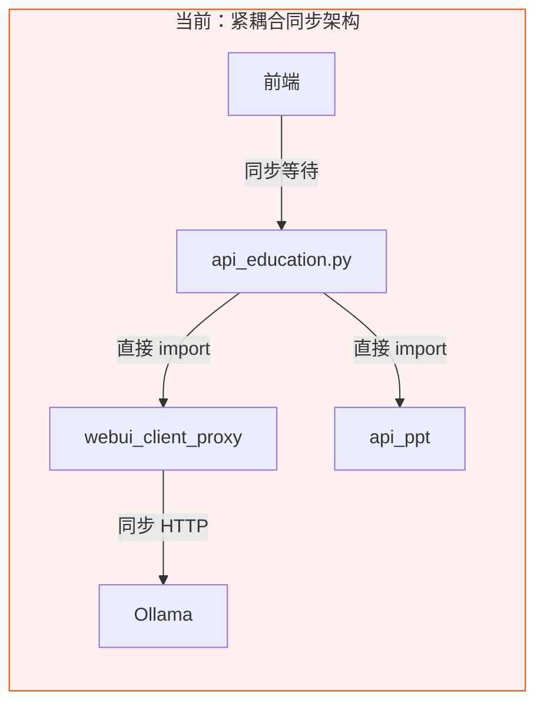
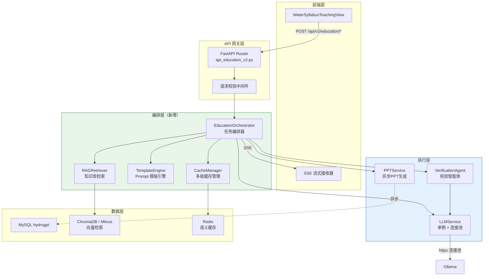
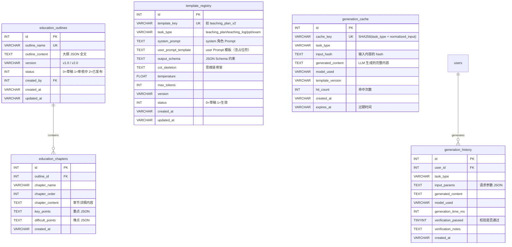
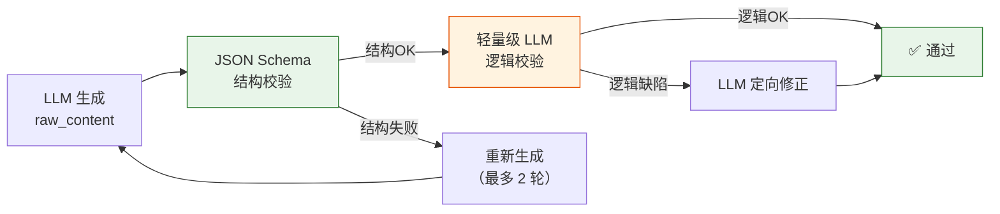
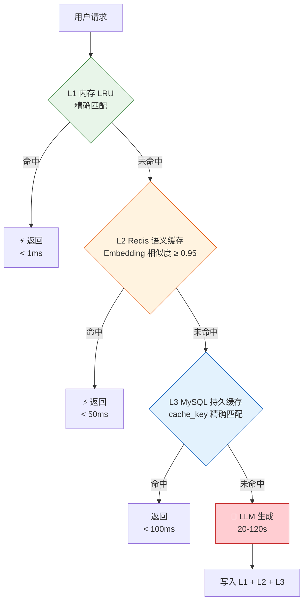
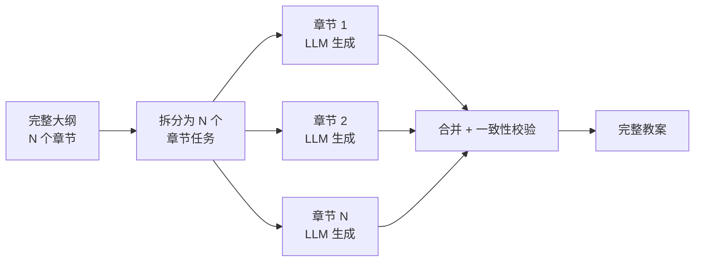

# 系统全方位迭代与优化方案

> 生成日期：2026-03-15 | 基于阶段一瓶颈分析报告

---

## 一、全局架构解耦设计

### 1.1 现有架构痛点



**问题总结**：

| 耦合点 | 位置 | 影响 |
|--------|------|------|
| `api_education.py` → `webui_client_proxy` | L87, L99 | 每个教育端点直接构造 Client，无法替换 LLM 后端 |
| `api_education.py` → `api_ppt` | L258 | PPT 生成与教案生成在同一请求中同步执行 |
| `_call_llm()` 硬编码参数 | L101-106 | 所有任务类型共享 `temperature=0.7, max_tokens=4096` |
| `_get_openwebui_client()` 每次新建 | L85-94 | 无客户端复用，无连接池 |
| 前端同步等待 | `chat.js` L23-34 | axios 5 分钟超时，用户无任何进度反馈 |

### 1.2 目标架构



### 1.3 核心组件设计

#### EducationOrchestrator — 任务编排器

替代当前 `api_education.py` 中各端点的"拼 Prompt → 调 LLM → 返回"扁平逻辑。

```python
# 伪代码：编排器核心流程
class EducationOrchestrator:
    async def generate(self, task_type: TaskType, request: EducationRequest) -> AsyncIterator[str]:
        # Step 1: 缓存命中检查
        cached = await self.cache_manager.lookup(task_type, request)
        if cached:
            yield cached; return

        # Step 2: RAG 检索相关知识
        context_docs = await self.rag_retriever.search(
            query=request.topic,
            filters={"chapter": request.chapter, "domain": "hydraulic"}
        )

        # Step 3: 模板引擎构建 Prompt
        prompt = self.template_engine.render(
            task_type=task_type,
            user_input=request,
            rag_context=context_docs,
            output_schema=TASK_SCHEMAS[task_type]
        )

        # Step 4: LLM 流式生成
        full_content = ""
        async for chunk in self.llm_service.stream(prompt, task_type.llm_config):
            full_content += chunk
            yield chunk  # SSE 推送

        # Step 5: 校验 Agent（轻量级）
        verification = await self.verifier.check(task_type, full_content, context_docs)
        if not verification.passed:
            # 自动修正（最多 2 轮）
            full_content = await self._auto_fix(task_type, full_content, verification)

        # Step 6: 缓存写入
        await self.cache_manager.store(task_type, request, full_content)
```

#### LLMService — 单例连接池

替代当前 `_get_openwebui_client()` 的每次新建模式：

```python
class LLMService:
    """单例 LLM 服务，维护 httpx 连接池"""
    _instance = None
    _client: httpx.AsyncClient = None

    @classmethod
    def instance(cls) -> "LLMService":
        if cls._instance is None:
            cls._instance = cls()
            cls._client = httpx.AsyncClient(
                base_url="http://114.55.148.1:8080",
                timeout=httpx.Timeout(300, connect=10),
                limits=httpx.Limits(max_connections=20, max_keepalive_connections=10),
            )
        return cls._instance

    async def stream(self, messages, config: LLMConfig) -> AsyncIterator[str]:
        """按任务类型动态调参的流式 LLM 调用"""
        payload = {
            "model": config.model,
            "messages": messages,
            "stream": True,
            "temperature": config.temperature,
            "max_tokens": config.max_tokens,
        }
        async with self._client.stream("POST", "/api/chat/completions", json=payload) as resp:
            async for line in resp.aiter_lines():
                # SSE 解析...
                yield delta_content
```

---

## 二、数据库矩阵优化

### 2.1 新增表设计



### 2.2 向量检索层规划

| 项目 | 方案 |
|------|------|
| **引擎** | ChromaDB（轻量级，与现有 Python 技术栈一致） |
| **语料来源** | ① GB 50201 等水利国标 PDF → 分块嵌入 ② 教材章节文本 ③ 已有知识库（OpenWebUI Knowledge Base 导出） |
| **Embedding 模型** | `bge-large-zh-v1.5`（中文最优，1024 维） |
| **检索策略** | Hybrid：BM25 关键词 + 向量相似度混合排序 |
| **集成方式** | 新建 `services/rag_service.py`，封装 ChromaDB 客户端，由 `EducationOrchestrator` 调用 |

---

## 三、生成模板引擎重构

### 3.1 当前硬编码 vs 目标模板化

````carousel
**当前：硬编码 Prompt（`api_education.py` L150-158）**

```python
# 教案生成 — 当前实现
user_content = (
    f"{prefix}\n\n"
    "请生成一份完整的教案，包含：课程名称、章节、教学目标、"
    "教学重点与难点、教学过程（步骤与时长）、课堂小结、课后作业等。"
    "若适合用 JSON 表达，请输出 JSON；否则输出清晰的结构化文本。"
)
messages = [
    {"role": "system", "content": "你是水利大纲教学生成智能体，..."},
    {"role": "user", "content": user_content},
]
```
<!-- slide -->
**目标：YAML 模板文件（`templates/teaching_plan_v2.yaml`）**

```yaml
template_key: teaching_plan_v2
task_type: teaching_plan
version: "2.0"
llm_config:
  temperature: 0.5        # 教案需稳定输出
  max_tokens: 8192         # 长教案需要更大 token
  enable_thinking: true    # 水利推导需要逐步思考

system_prompt: |
  你是水利工程领域的资深教学专家，拥有 20 年教学经验。
  你的任务是根据课程大纲生成专业、规范、可直接使用的教案。

  ## 能力边界
  - 仅生成水利工程相关的教学内容
  - 所有公式和数据必须引用国标或教材原文
  - 如不确定某知识点，必须标注 [待确认]

  ## 输出规范
  - 必须按照指定的 JSON Schema 输出
  - 教学步骤须明确时长分配，总时长须等于课时长度
  - 重难点须与大纲章节目标对齐

cot_skeleton: |
  请按以下思维链逐步完成：
  1. 分析大纲要求 → 确定本节课的知识目标和能力目标
  2. 检索相关规范 → 确认关键公式、参数、标准
  3. 设计教学过程 → 导入(10%) → 讲授(50%) → 练习(25%) → 总结(15%)
  4. 编制重难点 → 标注需要特别讲解的知识点
  5. 设计作业 → 包含基础题和提高题

user_prompt_template: |
  ## 课程信息
  {{course_info}}

  ## 参考资料（来自知识库检索）
  {{rag_context}}

  ## 任务
  {{cot_skeleton}}

  请按以下 JSON Schema 输出教案：
  {{output_schema}}

output_schema:
  type: object
  required: [course_title, chapter_title, teaching_objectives,
             key_points, difficult_points, teaching_steps,
             summary, homework]
  properties:
    course_title: { type: string }
    chapter_title: { type: string }
    teaching_objectives: { type: array, items: { type: string } }
    key_points: { type: array, items: { type: string } }
    difficult_points: { type: array, items: { type: string } }
    teaching_steps:
      type: array
      items:
        type: object
        required: [phase, title, content, time]
        properties:
          phase: { type: string }
          title: { type: string }
          content: { type: string }
          time: { type: string }
    summary: { type: string }
    homework: { type: array, items: { type: string } }
```
````

### 3.2 四种任务类型的模板参数矩阵

| 任务类型 | temperature | max_tokens | enable_thinking | 特殊约束 |
|----------|------------|-----------|----------------|----------|
| **教案生成** | 0.5 | 8192 | ✅ | JSON Schema 强制 + CoT 骨架 |
| **教学日志** | 0.6 | 4096 | ❌ | 结构化文本输出，含反思模块 |
| **PPT 教案** | 0.3 | 6144 | ✅ | 严格 JSON Schema + 幻灯片数量约束 |
| **试卷生成** | 0.2 | 8192 | ✅ | 题型/数量强制约束 + 答案校验 |

### 3.3 模板引擎 API

```python
class TemplateEngine:
    """Prompt 模板引擎 — 从数据库/YAML 加载模板并渲染"""

    def __init__(self, db_conn, fallback_dir="templates/"):
        self._db = db_conn
        self._fallback_dir = fallback_dir
        self._cache: Dict[str, PromptTemplate] = {}

    async def render(self, task_type: str, user_input: dict,
                     rag_context: str, output_schema: dict) -> List[dict]:
        template = await self._load_template(task_type)

        # 渲染 user prompt
        course_info = self._build_course_info(user_input)
        user_content = template.user_prompt_template \
            .replace("{{course_info}}", course_info) \
            .replace("{{rag_context}}", rag_context or "（无参考资料）") \
            .replace("{{cot_skeleton}}", template.cot_skeleton) \
            .replace("{{output_schema}}", json.dumps(output_schema, ensure_ascii=False, indent=2))

        return [
            {"role": "system", "content": template.system_prompt},
            {"role": "user", "content": user_content},
        ]

    async def _load_template(self, task_type: str) -> PromptTemplate:
        # L1: 内存缓存
        if task_type in self._cache:
            return self._cache[task_type]
        # L2: 数据库（支持热更新）
        row = await self._db.fetch_template(task_type, status=1)
        if row:
            tmpl = PromptTemplate.from_db_row(row)
            self._cache[task_type] = tmpl
            return tmpl
        # L3: 本地 YAML 文件（兜底）
        return PromptTemplate.from_yaml(f"{self._fallback_dir}/{task_type}.yaml")
```

---

## 四、生成逻辑与自洽性增强 — 校验 Agent

### 4.1 校验流程



### 4.2 三层校验机制

| 层级 | 校验内容 | 实现方式 | 成本 |
|------|---------|---------|------|
| **L1 结构校验** | JSON 是否合法、是否符合 Schema、必填字段是否齐全 | `jsonschema.validate()` — 纯代码 | ≈0ms |
| **L2 规则校验** | 教学步骤时长之和 = 课时长度、题目数量 = 要求数量、分值之和合理 | Python 规则引擎（if/else） | ≈1ms |
| **L3 语义校验** | 因果逻辑是否正确、知识点是否与大纲匹配、公式推导是否合理 | 短 Prompt LLM 调用（temperature=0.1, max_tokens=512） | ≈3-5s |

### 4.3 语义校验 Prompt 设计

```yaml
# 校验 Agent 使用独立的短 Prompt
verification_prompt:
  system: |
    你是一位严格的水利工程教学质量审核员。
    你的任务是检查以下教案/试卷的质量，重点关注：
    1. 因果逻辑是否正确（如：降雨→产流→汇流的推导链）
    2. 公式引用是否准确（如：曼宁公式、圣维南方程）
    3. 数值是否合理（如：流量单位 m³/s、水位单位 m）
    4. 是否与大纲目标对齐

    回复格式（JSON）：
    {
      "passed": true/false,
      "issues": [
        {"type": "logic|formula|value|alignment", "description": "具体问题", "suggestion": "修正建议"}
      ]
    }

  user_template: |
    ## 待审核内容
    {{generated_content}}

    ## 大纲要求
    {{outline_requirements}}

    ## 参考知识库
    {{rag_context}}
```

---

## 五、极致速度优化架构

### 5.1 多级缓存设计



| 缓存层 | 存储 | TTL | 容量 | 命中场景 |
|--------|------|-----|------|---------|
| **L1 内存** | `functools.lru_cache` 或 `cachetools.TTLCache` | 30min | 500 条 | 同一会话重复查询 |
| **L2 Redis** | Redis + Embedding 向量 | 24h | 10,000 条 | 语义相似请求（如"介绍洪峰流量" ≈ "什么是洪峰流量？"） |
| **L3 MySQL** | `generation_cache` 表 | 7d | 无限 | 历史生成内容持久化 |

### 5.2 流式输出全链路改造

#### 后端改造

```diff
# api_education.py — 从同步返回改为 SSE 流式
- async def generate_teaching_plan(body):
-     content = await _call_llm(messages, model)
-     return JSONResponse(content={"success": True, "content": content})
+ async def generate_teaching_plan(body):
+     async def event_stream():
+         async for chunk in orchestrator.generate(TaskType.TEACHING_PLAN, body):
+             yield f"data: {json.dumps({'delta': chunk})}\n\n"
+         yield "data: [DONE]\n\n"
+     return StreamingResponse(event_stream(), media_type="text/event-stream")
```

#### 前端改造

```diff
# WaterSyllabusTeachingView.vue — 从等待完整响应改为流式渲染
- const res = await chatCompletions(data)
- // 等待全部完成后一次性显示
+ streamChatCompletions(data,
+   (delta) => { contentBuffer += delta; updateDisplay() },
+   (error) => { showError(error) },
+   () => { finalize() }
+ )
```

### 5.3 多章节并行生成

当生成完整课程教案时（多个章节），可拆分为并行任务：



**实现方案**：`asyncio.gather()` 并发调用 LLM，理论加速比 ≈ min(N, Ollama并发上限)

---

## 六、前端优化方案

### 6.1 流式渲染改造

| 当前实现 | 改造方案 |
|---------|---------|
| `v-html` 直接注入 | 引入 `markdown-it` 实时解析 + 增量 DOM 更新 |
| `contentHtml` 每次全量重算 | 维护消息级缓存，仅重算新增消息 |
| 无进度指示 | SSE 接收过程显示打字机效果 + 进度条 |
| JSON 大块一次解析 | 流式 JSON 解析器（`streaming-json-stringify`） |

### 6.2 TeachingPlanPreview 性能优化

当前 `TeachingPlanPreview.vue` (36KB) 存在的问题与方案：

| 问题 | 方案 |
|------|------|
| `extractGeneratedFileFromMessage()` 使用多重正则扫描 | 流式接收时直接标记 JSON 起止位置，避免全文正则 |
| `watch` deep=true 监听整个消息数组 | 改为 `shallowRef` + 仅监听最后一条消息 |
| docx 导出 `Packer.toBlob()` 同步阻塞 UI | 移至 Web Worker 异步执行 |

---

## 七、改造影响矩阵

| 改造项 | 影响文件 | 改动量 | 风险 | 优先级 |
|--------|---------|--------|------|--------|
| LLMService 单例连接池 | `webui_client_proxy.py`, `api_education.py` | 中 | 低 | P0 |
| 流式输出改造 | `api_education.py`, `chat.js`, `WaterSyllabusTeachingView.vue` | 高 | 中 | P0 |
| 模板引擎 | 新建 `services/template_engine.py` + YAML 文件 + `template_registry` 表 | 高 | 低 | P1 |
| RAG 集成 | 新建 `services/rag_service.py`, 修改 `api_education.py` | 高 | 中 | P1 |
| 多级缓存 | 新建 `services/cache_manager.py` + `generation_cache` 表 + Redis | 中 | 低 | P1 |
| 校验 Agent | 新建 `services/verification_agent.py` | 中 | 中 | P2 |
| DB 连接池 | `database.py` 引入 `aiomysql` 连接池 | 低 | 低 | P2 |
| 前端流式渲染 | `WaterSyllabusTeachingView.vue`, `TeachingPlanPreview.vue` | 中 | 低 | P2 |
| 大纲版本管理 | 新建 2 张表 + 管理 API | 中 | 低 | P3 |

---

## 八、改造前后对比预估

| 指标 | 当前 | 改造后 | 提升 |
|------|------|--------|------|
| **首字输出延迟** | 20-120s（等全部完成） | 1-3s（流式首 token） | **10-60x** |
| **缓存命中响应** | —（无缓存） | < 100ms | 从无到有 |
| **Prompt 质量** | 硬编码一句话 system | CoT 骨架 + RAG 上下文 + Schema 约束 | 幻觉率显著下降 |
| **生成内容校验** | 无 | 三层校验（结构/规则/语义） | 从 0% → ~95% 可信度 |
| **DB 连接效率** | 每次新建 | 连接池复用 | 并发能力 10x |
| **模板迭代周期** | 改代码 → 部署 | 数据库热更新 | 从小时级 → 秒级 |
